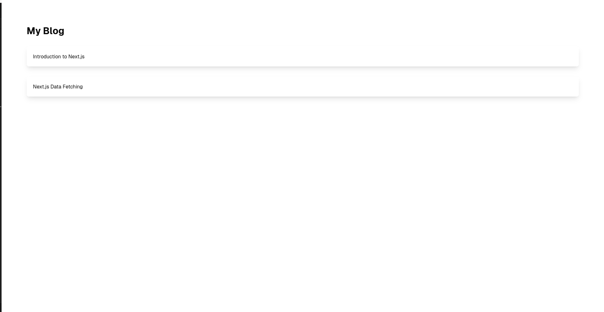
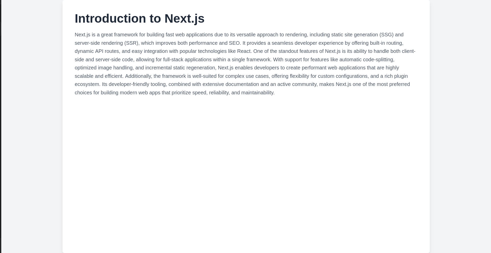
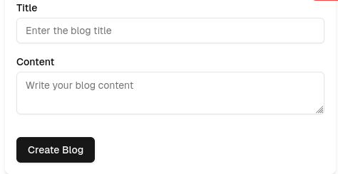
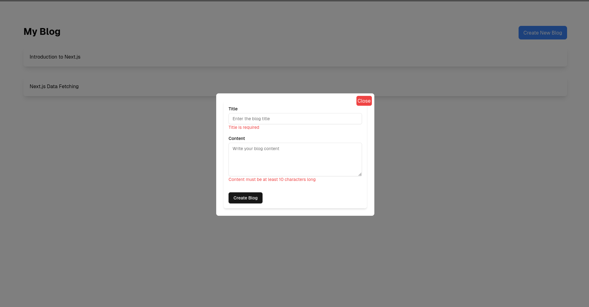
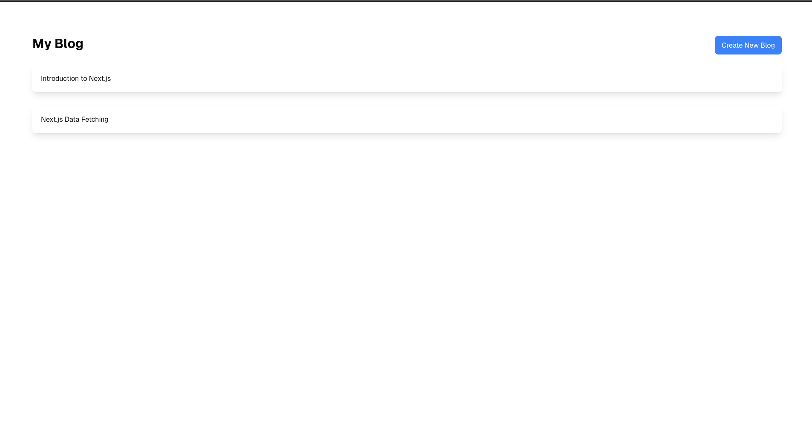
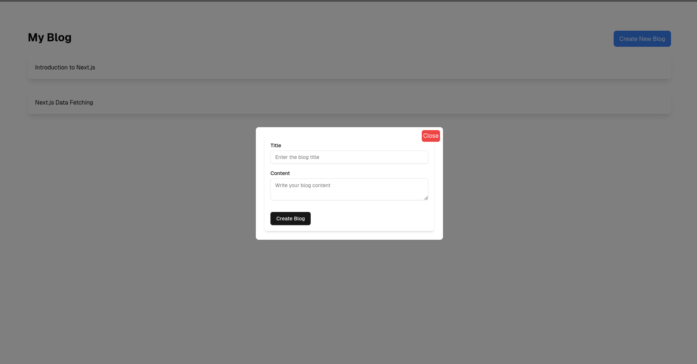

# blog-app-nextjs

### **Task 1: Set Up a Basic Blog Listing**
1. **Create a Next.js project** (use `create-next-app`).
2. **Create a `data` folder** inside the `app` directory to store mock blog posts.
3. **Create a simple Home page** that lists the blog posts from the `data/posts.ts` file.
   - Use the mock data to list blog post titles.
   - Make each blog title a clickable link that will eventually take the user to the blog details page (use `Link` from `next/link`).
4. **Create a dynamic post page** for each blog post.
   - Create a dynamic route (`posts/[id]/page.tsx`) that will display the content of each post based on its `id`.

### **Task 2: Create an API for Fetching Blog Posts**
1. **Create an API route** in `app/api/posts/route.ts` to return the list of blog posts as JSON.
   - This will replace the static `posts.ts` data used in Task 1.
2. **Fetch the blog posts dynamically** from the API on the Home page.

### **Task 3: Create a Form to Add New Blog Posts**
1. **Create a `CreateBlogForm` component** that includes fields for the blog title and content (Use ShadCn UI components).
2. **Add validation** using Zod.
   - Ensure the title field is required and has a maximum length of 100 characters.
   - Ensure the content field is required and has a minimum length of 10 characters.
3. **Use `react-hook-form`** to manage the form state.
   - Add a submit button and display validation error messages when the form is not filled out correctly.
4. **For now, log the form data** to the console when the form is successfully submitted.

### **Task 4: Create a Modal to Display the Form**
1. **Create a reusable Modal component**.
   - The modal should take in props like `isOpen`, `onClose`, and `children`.
   - Display the modal only when `isOpen` is `true`.
   - Add a close button to the modal.
2. **Add a "Create New Blog" button** to the Home page.
   - When this button is clicked, open the modal containing the `CreateBlogForm` component.
   - Allow the modal to be closed by either clicking the close button or clicking outside the modal.

### **Task 5: Advanced modal close**
We want whenever the user clicks outside the modal to be closed.
Hint:
- Think about using refs and useEffect hook (DOM manipulation!)
